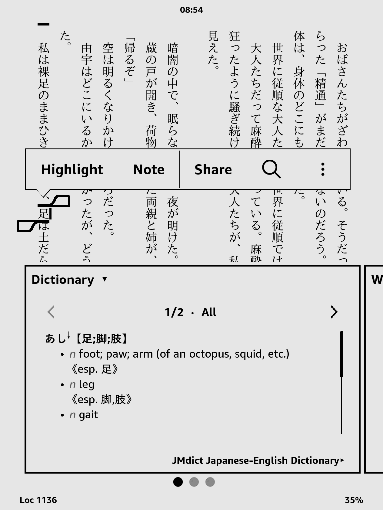

About
=====

This is a Japanese-English dictionary based on the
[JMdict](http://www.edrdg.org/jmdict/j_jmdict.html) and [JMnedict](https://www.edrdg.org/enamdict/enamdict_doc.html) and [Tatoeba](https://tatoeba.org/) database for
_e-Ink_ Kindle devices.

Features:

* lookup of inflected verbs.
* lookup for Japanese names.
* the dictionaries can be downloaded as separate files or as one big dictionary (the combined dictionary does not include example sentences due to file size restrictions)

<!--
Screenshots were captured inside the Kindle device as explained in
http://blog.blankbaby.com/2012/10/take-a-screenshot-on-a-kindle-paperwhite.html
then processed with ImageMagick's
`mogrify -colorspace gray -level 0%,111.11% -define PNG:compression-level=9`
to look like E-Ink display.
-->





Supported Devices
=================

The dictionary has been tested on _Kindle Paperwhite_ and _Kindle Oasis_.  It _should_ also work
well with other _e-ink_ Kindle devices

The dictionary will *not* work well on _Kindle Fire_ or _Kindle Android App_,
or any Android based Kindle, because the Kindle software on those platforms
does not support inflection lookups.


Download
========

You can download the latest version of the dictionary from
[here](https://github.com/jrfonseca/jmdict-kindle/releases).


Install
=======

_e-Ink_ Kindle
-----------------

There are in total 3 dictionaries:

* `jmdict.mobi`: Contains only data from the JMedict database, with additional examples. It does not contain proper names.
* `jmnedict.mobi`: Contains only Japanese proper names from the JMnedict databse.
* `combined.mobi`: Contains the data from both of the above dictionaries, but no examples.

To install any of the dictionaries (you can also install all three of them) into your device follow these steps:

* for 1st-generation Kindle Paperwhite devices, ensure you have
  [firmware version 5.3.9 or higher](http://www.amazon.com/gp/help/customer/display.html/ref=hp_left_cn?ie=UTF8&nodeId=201064850) as it includes improved homonym lookup for Japanese;
* connect your Kindle device via USB;
* copy the the `.mobi` file for the dictionary you want to use to the `documents/dictionaries` sub-folder;
* eject the USB device;
* on your device go to
  _Home > Settings > Device Options > Language and Dictionaries > Dictionaries_
  and set _JMdict Japanese-English Dictionary_ as the default dictionary for
  Japanese.

Kindle Android App
------------------

**NOTE: Unfortunately the Kindle Android App does not support dictionary inflections, yielding verbs lookup practically impossible. No known workaround.**

* rename `jmdict.mobi` or any of the other two dictionaries as `B005FNK020_EBOK.prc`

* connect your Android device via USB

* copy `B005FNK020_EBOK.prc` into `Internal Storage/Android/data/com.amazon.kindle/files/` or `/sdcard/android/data/com.amazon.kindle/files`

This will override the
[default Japanese-Japanese dictionary](https://kindle.amazon.com/work/daijisen-x5927-x8f9e-japanese-edition-ebook/B005FNK020/B005FNK020).


Building from source
====================

Requirements:

* Linux or Windows with Cygwin (might also work on macOS with a few changes)
* Python version 3

  * [Pycairo](http://www.cairographics.org/pycairo)
  * [Pillow](http://pillow.readthedocs.io/en/latest/)
  * [htmlmin](https://htmlmin.readthedocs.io/en/latest/index.html)

Inside of the makefile you can change the max number of sentences per entry, compression, as well as which sentences to include:

```makefile
# The Kindle Publishing Guidelines recommend -c2 (huffdic compression),
# but it is excruciatingly slow. That's why -c1 is selected by default.
COMPRESSION ?= 1
# Sets the max sentences per entry only for the jmdict.mobi.
# It is ignored by combined.mobi due to size restrictions.
# If there are too many sentences for the combined dictionary,
# it will not build (exceeds 650MB size limit).
SENTENCES ?= 5
# This flag determines wheter only good and verified sentences are used in the
# dictionary. Set it to TRUE if you only want those sentences.
# It is only used by jmdict.mobi.
# It is ignored bei combined.mobi. there it is always true
# this is due to size constraints.
ONLY_CHECKED_SENTENCES ?= FALSE
```

Build with make to create all 3 dictionaries:
```
make
```
or use any of the following commands to create a specific one:
```
make jmdict.mobi
make jmnedict.mobi
make combined.mobi
```

Please be aware that as of now the combined dictionary does not contain example sentences as this would push the `mobi` beyond the file size limit

To do
=====

* Leverage more of the JMdict data:

  * cross references
* Add Furigana to example sentences
* Create better covers
* Find a way to have sentences in the combined dictionary (maybe less names). The size limit for `mobi` of 650MB is reached quite fast.


Credits
=======

* Jim Breen and the [JMdict/EDICT project](http://www.edrdg.org/jmdict/j_jmdict.html) as well as the [ENAMDICT/JMnedict](https://www.edrdg.org/enamdict/enamdict_doc.html)
* The [Tatoeba](https://tatoeba.org/) project
* John Mettraux for his [EDICT2 Japanese-English Kindle dictionary](https://github.com/jmettraux/edict2-kindle)
* Choplair-network for their [Nihongo conjugator](http://www.choplair.org/?Nihongo%20conjugator)


Alternatives
============

* [John Mettraux's EDICT2 Japanese-English Kindle dictionary](https://github.com/jmettraux/edict2-kindle)

* [Amazon Kindle Store](http://www.amazon.com/s/url=search-alias%3Ddigital-text&field-keywords=japanese+english+dictionary)
